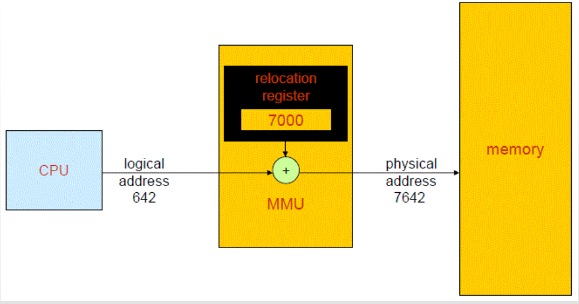
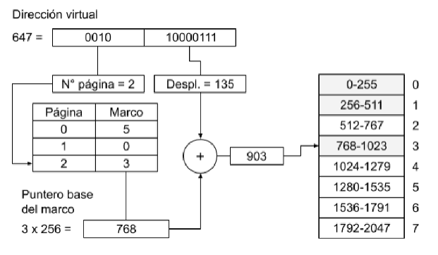
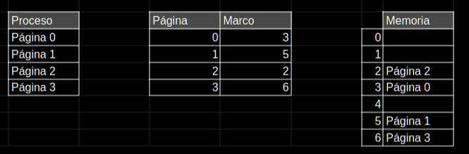
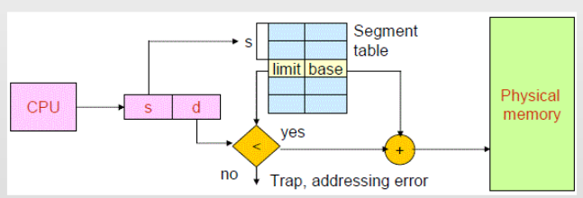
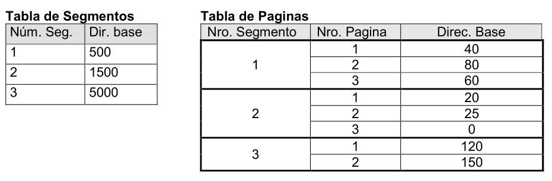
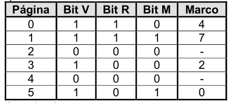
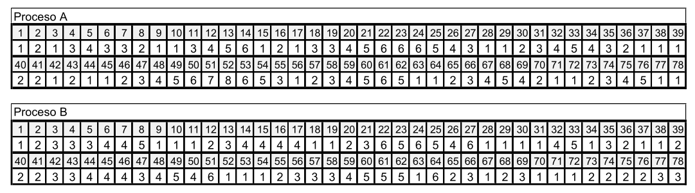
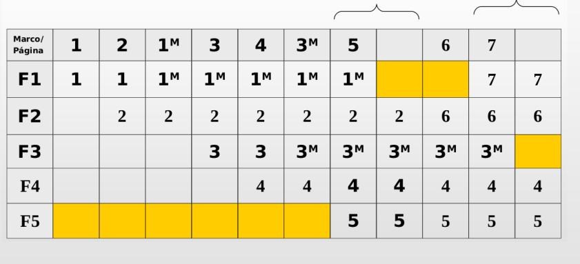

# Trabajo Práctico 5

## 1. Explique a que hacen referencia los siguientes términos: Dirección Lógica o Virtual, Dirección Física

La dirección lógica es aquella que hace referencia al espacio del proceso, y abstrae una dirección física. Es decir, es la dirección del proceso, considerando el espacio que virtualmente ocupa. Debe ser traducida.
La dirección física es una dirección real, con la que efectivamente se accede a memoria principal. Representa una referencia absoluta a una locación en memoria principal.
La CPU trabaja con direcciones lógicas que deben ser mapeadas a direcciones físicas. De esta tarea se encarga el MMU (Memory Management Unit).

## 2. Particiones fijas y particiones dinámicas

### (a) Explique como trabajan estos 2 métodos. Cite diferencias, ventajas y desventajas.

- Particiones fijas:
La memoria se divide en secciones de tamaño definido (los tamaños entre distintas particiones pueden ser iguales o no).
Cada sección es denominada partición y puede alocar un único proceso de acuerdo a un criterio de asignación (First Fit, Best Fit, Worst Fit).
Algunas particiones podrían ser muy pequeñas o muy grandes para determinados procesos, lo que podría producir búsquedas extensas por espacio libre o, por otro lado, desperdicio de espacio.
#####
- Particiones dinámicas:
La memoria se divide en particiones cuyo tamaño variará dependiendo del proceso que se quiera alocar. Se puede alocar un proceso por partición, y estas se generan de forma dinámica del tamaño justo que necesita el proceso.
Su principal ventaja es la redimensión de las particiones para evitar el desperdicio de espacio interno en ellas. Sin embargo, luego de alocar varios procesos, pueden quedar particiones dinámicas libres pequeñas entre otras ocupadas, lo cual genera un desperdicio de espacio externo a las particiones.  

### (b) ¿Qué información debe disponer el SO para poder administrar la memoria con estos métodos?

Esta técnica de asignación de memoria se utilizaba con un enfoque en el que los procesos se asignaban de forma completa en memoria.
En caso de particiones fijas, el SO debe conocer la cantidad de particiones en memoria, así como su dirección base, tamaño y su estado (libre/ocupada). Luego, cuando los procesos sean asignados, debe llevar registro de la partición en la que se encuentra cada proceso.
En caso de particiones dinámicas, como estas se crean de forma dinámica, el SO debe conocer los bloques de memoria que están libres (dirección base y tamaño). A medida que se alocan los procesos, se lleva un registro de la dirección de inicio del bloque asignado y su tamaño (el tamaño es igual al del proceso).

### (c) Realice un gráfico indicado como realiza el SO la transformación de direcciones lógicas a direcciones físicas.



La transformación de direcciones lógicas a direcciones físicas consiste en una dirección lógica (la CPU solicita acceso a ella), a la cual se le suma un registro de relocación, que es parte de la MMU, para obtener la dirección física.

## 3. Al trabajar con particiones fijas, los tamaños de las mismas se pueden considerar: Particiones de igual tamaño.Particiones de diferente tamaño. Cite ventajas y desventajas de estos 2 métodos.

Con particiones de igual tamaño las operaciones de asignación son más sencillas pues, considerando que el tamaño es suficientemente grande para que cualquier proceso quepa, simplemente puede asignarse en el primero disponible, sin necesidad de realizar una búsqueda. Por otro lado, esto implica un desperdicio de espacio interno de la partición considerable, ya que es probable que la mayoría de procesos sean de menor tamaño que la partición.
Con particiones de distinto tamaño, este problema del desperdicio de espacio interno se soluciona en cierta medida. Sin embargo, la alocación de procesos requerirá una lógica más compleja, pues ya no puede ser ubicado en cualquier particiones (para ello están las ténicas de asignación ya mencionadas).

## 4. Fragmentación. Ambos métodos de particiones presentan el problema de la fragmentación: Fragmentación Interna (Para el caso de Particiones Fijas). Fragmentación Externa (Para el caso de Particiones Dinámicas)

### (a) Explique a que hacen referencia estos 2 problemas

La fragmentación interna consiste en el espacio asignado no ocupado. Puede suceder en el método de particiones fijas, donde un proceso sea de menor tamaño que la partición y, por lo tanto, existe un fragmento de esta la cual fue asignada al proceso pero no está siendo usada.
La fragmentación externa consiste en el espacio no asignado no ocupado. Puede suceder en el método de particiones dinámicas, donde existan bloques libres de pequeño tamaño entre particiones ocupadas. Estos espacios no están asignados a ningún proceso. Sin embargo, constituyen un desperdicio de la memoria porque, dado su reducido tamaño, no pueden ser utilizados para alocar un proceso.

### (b) El problema de la Fragmentación Externa es posible de subsanar. Explique una técnica que evite este problema.

Un método para resolver la fragmentación externa es la compactación. Este consiste en mover las particiones ocupadas para un extremo del espacio de direcciones de la memoria, agrupando los bloques libres de forma contigua para que puedan formar particiones más grandes de las que podrían con sus tamaños individuales.
Sin embargo, realizar este procedimiento resulta costoso debido a la tarea que implica reubicar todas las particiones ocupadas para dejar los bloques libres de manera contigua.

## 5. Paginación

### (a) Explique como trabaja este método de asignación de memoria.

El método divide el espacio de direcciones virtual del proceso en secciones llamadas páginas.
A su vez, la memoria está dividida en marcos de igual tamaño que las páginas. Este tamaño puede ser, por ejemplo, de 512 Bytes.
Una página de un proceso se asigna a un marco en memoria física. De esta forma, el proceso no requiere estar alocado de forma contigua (las páginas pueden estar en marcos no consecutivos).

### (b) ¿Qué estructuras adicionales debe poseer el SO para llevar a cabo su implementación?

El SO debe poseer una tabla de páginas por cada proceso, la cuál indique el número de página y el número de marco al que fue asignado. Para cada entrada de la tabla se pueden tener bits adicionales como bit de presencia/ausencia (página en memoria o disco), bit de modificación (indica si la página se modificó desde que está en memoria), bit de acceso (indica si la página se usó recientemente). 
A su vez, se tiene tabla de marcos indicando el estado de cada marco (libre u ocupado), la página asignada (si está ocupado). No es necesario registrar la dirección base o el tamaño porque estos tienen un tamaño fijo. La dirección base es calculable a partir del número de marco y el tamaño.

### (c) Explique, utilizando gráficos, como son transformadas las direcciones lógicas en físicas.


*En el gráfico se utiliza un tamaño de página de 256 bytes*

La dirección lógica es utilizada para obtener el número de página (ej.: direccion lógica / tamaño de página). Luego, se revisa en la tabla de páginas a que marco está asignado dicha página. A su vez, de la dirección lógica se obtiene el desplazamiento dentro de la página (el cual es menor su tamaño) (ej.: dirección lógica mod tamaño de página).
Teniendo el marco se conoce las direcciones que este abarca (base y límite). Si a la dirección base del marco (número de marco * tamaño de marco) se le suma el desplazamiento, se obtiene la dirección física a partir de la dirección lógica. 

### (d) En este esquema: ¿Se puede producir fragmentación (interna y/o externa)?

En este esquema no es posible que se produzca fragmentación externa, ya que los tamaños de los marcos son fijos y se corresponden con los tamaños de las páginas (no pueden haber marcos no asignados que no puedan ser ocupados). Aunque se podría pensar que tampoco puede ocurrir fragmentación interna, la realidad es que, excepto que el tamaño del proceso sea múltiplo del tamaño de página, en la última página siempre habrá espacio asignado no ocupado (pues el proceso no tiene suficiente tamaño para ocupar completamente la última página). Si se tienen en cuenta conceptos de segmentación, la fragmentación interna también puede producirse en otras páginas del proceso.

## 6. Cite similitudes y diferencias entre la técnica de paginación y la de particiones fijas.

Entre las similitudes se puede considerar que la memoria se divide en secciones de tamaño fijo, y este no es modificado de forma dinámica.
Sin embargo, en el método de particiones fijas, cada partición puede tener un tamaño distinto, lo cual no sucede en paginación.
Además, en las particiones el proceso debe cargarse de forma completa y contigua en una única partición, mientras en paginación este estará dividido en distintas secciones (páginas en marcos) que pueden o no estar contiguos. Esto también se apoya en la idea de que el espacio de direcciones del proceso se divide en páginas, mientras que en particiones fijas no hay ninguna división lógica del proceso.

## 7. 

Suponga un sistema donde la memoria es administrada mediante la técnica de paginación, y donde:
- El tamaño de la página es de 512 bytes
- Cada dirección de memoria referencia 1 byte.
- Los marcos en memoria principal de encuentran desde la dirección física 0.

Suponga además un proceso con un tamaño 2000 bytes y con la siguiente tabla de páginas:

| Pagina        | Marco         |
| ------------- | ------------- |
| 0             | 3             |
| 1             | 5             |
| 2             | 2             |
| 3             | 6             |

### (a) Realice los gráficos necesarios (de la memoria, proceso y tabla de paginas) en el que reflejen el estado descrito.



### (b) Indicar si las siguientes direcciones lógicas son correctas y en caso afirmativo indicar la dirección física a la que corresponden:

Se considera:

> $Nro\ de\ página = \frac{Dirección\ virtual}{Tamaño\ página}$
>
> $Desplazamiento = Dirección\ virtual \mod{Tamaño\ página}$
>
> $Dirección\ física = (Nro\ de\ marco \times Tamaño\ página) + Desplazamiento$

El número de marco se obtiene consultando la tabla de páginas a partir del número de página calculado.
Para el número de página solo se toma la parte entera del cociente.

1. 35: corresponde a dirección física 1571
2. 512: corresponde a dirección física 2560
3. 2051: no es correcta para el proceso evaluado
4. 0: corresponde a dirección física 1536
5. 1325: corresponde a dirección física 1325
6. 602: corresponde a dirección física 2650

### (c) Indicar, en caso de ser posible, las direcciones lógicas del proceso que se corresponden a las siguientes direcciones físicas:

Se considera:

> $Nro\ de\ marco = \frac{Dirección\ física}{Tamaño\ página}$
>
> $Desplazamiento = Dirección\ física \mod{Tamaño\ página}$
>
> $Dirección\ virtual = (Nro\ de\ página \times Tamaño\ página) + Desplazamiento$

El número de página se obtiene consultando la tabla de páginas a partir del número de marco calculado.
Para el número de marco solo se toma la parte entera del cociente.

1. 509: no se corresponde con una página del proceso
2. 1500: se corresponde con dirección virtual 1500
3. 0: no se corresponde con una página del proceso
4. 3215: se corresponde con dirección virtual 1679
5. 1024: se corresponde con dirección virtual 1024
6. 2000: se corresponde con dirección virtual 464

### (d) Indique, en caso que se produzca, la fragmentación (interna y/o externa)

Existe fragmentación interna en la página 3 del proceso. El proceso tiene un tamaño de 2000 Bytes. Cada página tiene un tamaño de 512 Bytes. Si se tienen 4 páginas, da un total de $4 \times 512 = 2048$.
Por lo tanto, hay 48 Bytes sin utilizar en la página 3, lo que implica fragmentación interna.

## 8. Considere un espacio lógico de 8 paginas de 1024 bytes cada una, mapeadas en una memoria física de 32 marcos.

### (a) ¿Cuantos bits son necesarios para representar una dirección lógica?

Para conformar una dirección lógica se necesita considerar la cantidad de bits necesarios para identificar la página y el desplazamiento.
Existen 8 páginas que pueden ser direccionadas, por lo que:
> $⌈\log_{2} 8⌉ = 3\ bits$

A su vez, cada página tiene 1024 bytes. Considerando que cada dirección hace referencia a 1 byte dentro de la página, se deben poder direccionar 1024 bytes. Por lo tanto:
> $⌈\log_{2} 1024⌉ = 10\ bits$

Los bits totales para la dirección lógica:
>$Bits\ dirección\ lógica = bits\ para\ número\ de\ página + bits\ para\ desplazamiento$
>
>$Bits\ dirección\ lógica = 3\ bits + 10\ bits = 13\ bits$

### (b) ¿Cuantos bits son necesarios para representar una dirección física?

Para el cálculo de la dirección física se sigue una lógica similar. Se tienen 32 marcos, lo que implica 5 bits para identificar el marco.
A su vez, cada marco tiene un tamaño de 1024 bytes. Considerando una dirección que referencia 1 byte, se tienen 10 bits para referenciar el desplazamiento.

Los bits totales para la dirección física:
Los bits totales para la dirección lógica:

>$Bits\ dirección\ física = bits\ para\ número\ de\ marco + bits\ para\ desplazamiento$
>
>$Bits\ dirección\ física = 5\ bits + 10\ bits = 15\ bits$

## 9. Segmentación

### (a) Explique como trabaja este método de asignación de memoria.

El método de segmentación divide lógicamente el espacio de direcciones en segmentos que agrupan contenido del proceso según su funcionalidad (código, datos, pila, etc.).
Estos no tienen un tamaño fijo y se asignan en la memoria física de forma no necesariamente contigua entre distintos segmentos, aunque si para un mismo segmento.
Esta división en segmentos benefica el uso de áreas compartidas, tal como puede suceder cuando dos usuarios ejecutan el mismo proceso, en el que el segmento de datos será distinto pero el de código el mismo. Al compartir el segmento, se evita cargar dos veces el mismo contenido en memoria.

### (b) ¿Qué estructuras adicionales debe poseer el SO para llevar a cabo su implementación?

El sistema operativo debe llevar una tabla de segmentos para cada proceso. Esta posee la dirección base del segmento en memoria física y el tamaño del segmento (cada segmento puede ser de un tamaño distinto), o bien una dirección límite.
Las direcciones lógicas constan del número del segmento y un desplazamiento dentro del segmento, que debe ser menor al límite.

### (c) Explique, utilizando gráficos, como son transformadas las direcciones lógicas en físicas.



A partir de la dirección lógica, se obtiene el número de segmento. Con él, se accede a la tabla de segmentos del proceso, de donde se obtiene la dirección base del segmento y el límite. Se verifica que el desplazamiento en la dirección virtual sea menor que el límite. Si lo es, se le suma el desplazamiento a la dirección base obtenida en la tabla y sea accede al segmento en memoria física. 

### (d) En este esquema: ¿Se puede producir fragmentación (interna y/o externa)?

En la segmentación no puede producirse fragmentación interna, ya que los segmentos tienen tamaños que se ajustan a los procesos (a cada sección de este).
Sin embargo, puede producir fragmentación externa, ya que los segmentos se asignan en bloques contiguos de la memoria física, y podrían quedar bloques libres de espacio reducido (espacio no asignado no ocupado), los cuales sean insuficientes para alojar nuevos segmentos.

## 10. Cite similitudes y diferencias entre la técnica de segmentación y la de particiones dinámicas.

Tanto en la segmentación como en las particiones dinámicas, el proceso se aloca en memoria dividido en secciones de tamaño variable, lo que impide la existencia de fragmentación interna. Debido a su naturaleza, las secciones en memoria poseen tamaños distintos. Esto tiende a producir fragmentación externa.
Sin embargo, en la segmentación, el proceso se divide en segmentos en su espacio de direcciones, y es alocado respetando esta división. Es decir, no se carga todo el proceso en una sección de memoria de manera contigua, sino que lo hace por segmentos, los cuales podrían no ser asignados físicamente de forma consecutiva.
Por otro lado, en el esquema de particiones dinámicas los procesos se cargan enteramente en una partición, admitiendo un solo proceso (pero en su totalidad) en cada partición. 

## 11. Cite similitudes y diferencias entre la técnica de paginación y segmentación.

Ambas técnicas dividen el espacio de direcciones lógicas del proceso. La paginación divide en porciones de tamaño fijo, mientras la segmentación lo hace en secciones de tamaño variable.
Ambas traducen su dirección lógica a física a través de tablas (de páginas y de segmentos respectivamente), existiendo una por proceso.
Tanto paginación como segmentación permiten que los procesos sean alocados en secciones no contiguas en memoria física.

Sin embargo, la paginación divide los procesos en páginas de tamaño fijo, mientras que la segmentación lo hace en segmentos de tamaño variable, agrupando por funcionalidad. Todas las páginas son del mismo tamaño, mientras que con los segmentos esto no suele ocurrir.
Las tablas de páginas guarda número de página y marco en el que se asigna, mientras que la tabla de segmento posee una dirección base y límite.
La paginación puede producir fragmentación interna. La segmentación tiende a producir fragmentación externa.
El propósito principal de la paginación es eliminar la fragmentación externa y optimizar el uso de la memoria. Mientras tanto, la segmentación favorece la modularidad debido a la organización según la estructura lógica del programa. 

## 12. Cálculo de direcciones físicas en segmentación paginada



Para calcular las direcciones físicas a partir de las direcciones lógicas en segmentación paginada se debe:
1. Identificar la dirección base del segmento a partir de la tabla de segmentos
2. Identificar la dirección base de la página en el segmento, a partir de la tabla de páginas
3. Sumar el desplazamiento

> $Dirección\ física = Dirección\ base\ del\ segmento + Dirección\ base\ de\ la\ página + Desplazamiento$

Considerando segmento, página, desplazamiento:

- (2, 1, 1): 1521
- (1, 3, 15): 575
- (3, 1, 10): 5130
- (2, 3, 5): 1505

## 13. Memoria Virtual

### (a) Describa que beneficios introduce este esquema de administración de la memoria.

La memoria virtual permite que el proceso no esté cargado enteramente en memoria, sino en la justa medida para que pueda ejecutarse sin problemas.
En la paginación tradicional, todas las páginas del proceso están cargadas en memoria. En la técnica de memoria virtual con paginación, se cargan en memoria solo aquellas páginas que el proceso utiliza.
Esto permite que se pueda ejecutar un proceso cuyo tamaño es superior al de la memoria. Virtualmente este se encuentra completo y contiguo. Físicamente, solo las páginas necesarias para un determinado momento están cargadas en memoria. A esto se le conoce como paginación por demanda, pues las páginas son cargadas en memoria a medida que son requeridas por el proceso.

### (b) ¿En que se debe apoyar el SO para su implementación?

El SO debe mantener una tabla de páginas que indique en que marco físico se encuentra mapeada cada página lógica. Hay una tabla por proceso.
Se debe tener un área de intercambio en el disco (área swap) que permita mantener aquellas páginas del proceso que no han sido cargadas a memoria principal aún.
Además, se debe considerar el MMU, que traduce las direcciones lógicas a físicas apoyándose en la tabla de páginas. 

### (c) Al implementar está técnica utilizando paginación por demanda, las tablas de paginas de un proceso deben contar con información adicional además del marco donde se encuentra la página. ¿Cuál es está información? ¿Por qué es necesaria?

Además del marco asociado a la página, la tabla de páginas de un proceso debe contener:
- Bit de Valid/Invalid (V): indica si la página están en memoria principal o almacenamiento secundario (área de swapping). Un 1 en bit V indica que la entrada es válida, pues la página está en memoria. Si es 0, los demás bits no son tenidos en cuenta.
- Bit de modificado (M) o dirty bit: indica si la página ha sido modificada mientras estaba en memoria (para luego reflejar los cambios en el disco). Ahorra escrituras innecesarias en disco.
- Dirección en el almacenamiento secundario: si la página no está en memoria principal, indica en que parte del disco está.
- Bit de acceso (R): indica si la página ha sido accedida recientemente. Si R = 1, significa que la página ha sido accedida (lectura o escritura) durante el tiempo que estuvo en memoria. Si R = 0 significa que la página no ha sido accedida desde que se cargó en memoria. Este bit es útil para algunos algoritmos de reemplazo de páginas.
Tambien se puede usar para indicar los permisos de lectura/escritura de la página

## 14. Fallos de Página (Page Faults):

### (a) ¿Cuándo se producen?

Los fallos de página (Page Faults) se producen cuando un proceso intenta acceder a una dirección de memoria virtual correspondiente a una página del mismo que no se encuentra cargada en memoria.
Al suceder esto, la ejecución del proceso es detenida y la página debe ser cargada en memoria.
Es lo que se conoce como paginación por demanda.

### (b) ¿Quién es responsable de detectar un fallo de página?

El Hardware detecta un acceso indebido a memoria y produce un trap al SO. A partir de esto, el SO determina que la excepción se debe a un fallo de página y bloquea el proceso mientras gestiona la carga de la página (que constituye una operación E/S, pues está en disco).

### (c) Describa las acciones que emprende el SO cando se produce un fallo de página.

Como se explicó anteriormente, es el Hardware el que detecta el fallo de página (en realidad detecta una acceso indebido a memoria, que genera un trap). El SO determina que la excepción levantada se debe un fallo de página y bloquea el proceso mientras se administra la carga de la página.
El sistema operativo busca un frame libre para copiar la página. Cuando esta es cargada, se actualiza la tabla de página para indicar que ahora la página está en memoria principal. El proceso vuelve a Ready para competir por la CPU.
Si la memoria no tuviera frames libres, se debe elegir una página víctima (utilizando alguno de los algoritmos de reemplazo de página), para liberar el marco que ocupa dicha página.

## 15. Direcciones:

### (a) Si se dispone de una espacio de direcciones virtuales de 32 bits, donde cada dirección referencia 1 byte:

#### (i) ¿Cuál es el tamaño máximo de un proceso (recordar “espacio virtual”)?

Si la dirección virtual es de 32 bits, significa que puede direccionar $2^{32}$ direcciones. A razón de que cada dirección referencia 1 Byte, $2^{32} \times 1 = 2^{32}\ Bytes$
$2^{32}\ Bytes = 4GB$

#### (ii) Si el tamaño de pagina es de 512Kb. ¿Cuál es el número máximo de paginas que puede tener un proceso?

A razón del tamaño máximo de $2³²\ Bytes$ y un tamaño de página de $512Kb = 2¹⁹\ Bytes$, la cantidad máxima de páginas que puede tener un proceso es $\frac{2³²}{2¹⁹} = 2¹³ = 8192\ páginas$.

#### (iii) Si el tamaño de pagina es de 512Kb. y se disponen de 256 Mb. de memoria real ¿Cuál es el número de marcos que puede haber?

Considerando tamaño de página $512Kb = 2¹⁹\ Bytes$, y una memoria de $256Mb = 2²⁸\ Bytes$, el número de marcos es $\frac{2²⁸}{2¹⁹} = 2⁹ = 512\ marcos$.

#### (iv) Si se utilizaran 2 Kb. para cada entrada en la tabla de páginas de un proceso: ¿Cuál seria el tamaño máximo de la tabla de páginas de cada proceso?

Teniendo en cuenta que el proceso de mayor tamaño posee $8192\ páginas$, considerando $2kB$ el tamaño de cada entrada de la tabla, entonces el tamaño máximo de la tabla de páginas sería de $Cantidad\ de\ páginas\ máxima \times Tamaño\ de\ entrada\ en\ la\ tabla$.

> $8192 \times 2kB = 16MB$

## 16. 
**Como se vio en el ejercicio anterior, la tabla de páginas de un proceso puede alcanzar un tamaño considerablemente grande, que incluso, no podría almacenarse de manera completa en la memoria real. Es por esto que el SO también realiza paginación sobre las tablas de paginas. Existen varios enfoques para administrar las tablas de páginas:**
**- Tablas de páginas de 1 nivel.**
**- Tablas de páginas de 2 niveles.**
**- Tablas de páginas invertidas.**
**Explique brevemente como trabajan estos enfoques e indique como se realiza la transformación de la dirección virtual en dirección física.**

- Tablas de páginas de 1 nivel:
La tabla de páginas es una estructura simple donde cada entrada corresponde a una página virtual del proceso y almacena el número de marco al que está mapeado la página. Es la tabla tal como la conocemos hasta ahora.
La dirección virtual se compone del número de página y el desplazamiento y un desplazamiento. Con el número de página se obtiene el marco en el que está mapeado. De esta forma, se construye la dirección física a través de combinar la dirección base del marco con el desplazamiento.
Es sencillo de implementar pero puede ser de un tamaño considerable, por lo que podría no caber en memoria principal.

- Tablas de páginas de 2 niveles:
La tabla de páginas se divide en dos niveles: tabla de nivel superior (cada entrada apunta a una subtabla) y tabla de nivel inferior (subtabla que contiene las direcciones físicas de los marcos).
La dirección virtual se compone de un índice de nivel superior, un índice de nivel inferior y un desplazamiento.
Con el índice de nivel superior se obtiene la subtabla correspondiente. Luego, con el índice de nivel inferior se obtiene el número de marco desde la subtabla obtenida. Finalmente, se construye la dirección física combinando la dirección base del marco correspondiente con el desplazamiento.
Permite ahorrar espacio, pues en memoria principal se almacena la tabla de nivel 1, mientras las tablas de nivel 2 se generan a medida que se requieren, según la página que se vaya a cargar. Como desventaja, se producen mayor cantidad de accesos a memoria.

- Tablas de páginas invertidas:
Se tiene una tabla de páginas global, no una por proceso. Cada entrada en la tabla corresponde a un marco de memoria física y señala que página virtual y proceso están cargadas en ese marco. Se implementa como estructura de hashing.
La dirección virtual se compone del PID del proceso, el número de página virtual y un desplazamiento. Se busca en la tabla una entrada que coincida en PID y número de página virtual. Si se encuentra coincidencia, se toma el número de marco y se obtiene la dirección física a partir de la dirección base del marco y el desplazamiento.
Requiere menos memoria, pues hay una sola tabla global que contiene los marcos de la memoria.
Debido a la complejidad adicional y a la posible existencia de colisiones, la velocidad de acceso puede verse afectada. Por ello se suele utilizar una TLB (Translation Lookaside Buffer), una caché que almacena las entradas marco/página más recientemente consultadas para evitar accesos frecuentes a la tabla en memoria principal.

## 17. Suponga que la tabla de páginas para un proceso que se está ejecutando es la que se muestra a continuación:



**Asumiendo que:**
- **El tamaño de la pagina es de 512 bytes**
- **Cada dirección de memoria referencia 1 byte**
- **Los marcos se encuentras contiguos y en orden en memoria (0, 1, 2.. ) a partir de la dirección real 0.**

**¿Qué dirección física, si existe, correspondería a cada una de las siguientes direcciones virtuales? (No gestione ningún fallo de página, si se produce)**

Se utilizan mismas fórmulas que en **7b**

1. 1052: fallo de página
2. 2221: fallo de página
3. 5499: fuera de rango para las páginas de la tabla
4. 3101: fuera de rango para las páginas de la tabla

## 18. Tamaño de la Página

**La selección del tamaño de la página influye de manera directa sobre el funcionamiento de la memoria virtual. Compare las siguientes situaciones con respecto al tamaño de página, indicando ventajas y desventajas:**

- Un tamaño de página pequeño:

El tamaño de página es definido por la arquitectura. Está dado por la interpretación de la dirección virtual y la cantidad de bits de esta reservados para el desplazamiento.
Un tamaño de página pequeño implica una menor fragmentación interna. Esta puede estar presente tanto en la última página como en páginas intermedias en un esquema de segmentación paginada (no puede haber dos segmentos en una misma página).
A su vez, los procesos requerirán más páginas, lo que aumentará el tamaño de la tabla de páginas.
Además, se podrán tener más páginas en memoria principal. Al ser más compactas, se asegura que disminuya la cantidad de contenido de una página que no se utiliza. Son unidades más compactas y útiles, permitiendo alojar más páginas de otros procesos.

- Un tamaño de página grande:

Implica una mayor framentación interna. Asimismo, un mayor tamaño de página significa una transferencia más eficiente. La memoria secundaria está diseñada para transferir bloques de datos grandes más eficientementente, por lo que es con cada transferencia se mueve mayor volumen de datos hacia memoria principal. Esto se debe a que el tiempo de búsqueda está mayormente retardado por el posicionamiento del cabezal en contraposición con la velocidad de transferencia.
Además, mayor tamaño implica menos páginas, por lo que las tablas de páginas ocupan menos espacio.

## 19. Asignación de marcos a un proceso (Conjunto de trabajo o Working Set):
**Con la memoria virtual paginada, no se requiere que todas las páginas de un proceso se encuentren en memoria. El SO debe controlar cuantas páginas de un proceso puede tener en la memoria principal. Existen 2 políticas que se pueden utilizar:**
- **Asignación Fija**
- **Asignación Dinámica.**

### (a) Describa como trabajan estas 2 políticas.

La asignación fija consiste en que a cada proceso se le asigna una cantidad determinada de marcos, independientemente de sus necesidades durante la ejecución. La cantidad de marcos que se le asignarán se determina en el momento que el proceso se carga en memoria. El proceso no puede ocupar más marcos de los asignados. Cuando se produce un fallo de página, el proceso debe liberar uno de los marcos asignados.
Es un método de asignación sencillo, pero poco flexible. Puede resultar ineficiente pues un proceso podría desperdiciar marcos por ser pequeño mientras para otro podrían resultar insuficientes.
Dentro de la asignación fija se tiene el reparto equitativo (a todos los procesos se le asigna la misma cantidad de marcos) y el reparto proporcional (la cantidad de marcos depende de las necesidades del proceso, señalada por su tamaño).
El reparto equitativo está dado por la fórmula $m\ div\ p$, donde $m$ es la cantidad de marcos y $p$ la cantidad de procesos
El reparto proporcional está dado por la fórmula $V_p \times \frac{m}{V_t}$, donde 
- $V_p$ es el tamaño de la memoria virtual del proceso. Cantidad de páginas del proceso.
- $m$ es el número total de marcos disponibles en memoria física.
- $V_t$ es el tamaño de la memoria virtual total del sistema (suma de las memorias virtuales de todos los procesos en Ready). La suma de la cantidad de páginas de todos los procesos.

La asignación dinámica se caracterizado por asignar a cada proceso un número de marcos que puede variar durante su ejecución, dependiendo de las necesidades de este y la disponibilidad de memoria.
Si durante la ejecución del proceso se producen fallos de página y hay memoria libre, se le asignan más marcos. Si no hay, se aplica la política de reemplazo global para liberar marcos.
Esta técnica provee mayor flexibilidad y mejor utilización de la memoria, asignando marcos a los procesos que los utilizan. Sin embargo, es más compleja de implementar y puede generar conflictos como la hiperpaginación (thrashing), cuando se producen continuos fallos de página debido a que hay muchos procesos compitiendo por la memoria.

### (b) Dada la siguiente tabla de procesos y las paginas que ellos ocupan, y teniéndose 40 marcos en la memoria principal, cuantos marcos le corresponderían a cada proceso si se usa la técnica de Asignación Fija:

| Proceso       | Total de páginas usadas |
| ------------- | ----------------------- |
| 1             | 15                      |
| 2             | 20                      |
| 3             | 20                      |
| 4             | 8                       |

- Reparto Equitativo:

$p = Cantidad\ de\ procesos$
$m = Cantidad\ de\ marcos$

$m\ div\ p = 40\ div\ 4 = 10$
Le corresponden 10 marcos a cada proceso

- Reparto Proporcional

Considerando $V_p \times \frac{m}{V_t}$
Proceso 1 = 9
Proceso 2 = 12
Proceso 3 = 12
Proceso 4 = 5

### (c) ¿Cuál de los 2 repartos usados en (b) resultó más eficiente? ¿Por qué?

El reparto proporcional resultó más eficiente ya que asigna marcos en función de la cantidad de páginas del proceso. Con el reparto equitativo se observa que algunos procesos poseen más marcos que cantidad de páginas virtuales, mientras que para otros la cantidad es insuficiente para las páginas que posee.

## 20. Reemplazo de páginas (selección de una victima):
**¿Qué sucede cuando todos los marcos en la memoria principal están usados por las páginas de los procesos y se produce en fallo de página? El SO debe seleccionar una de las páginas que se encuentra en memoria como victima, y ser reemplazada por la nueva página que produjo el fallo.**
**Considere los siguientes algoritmos de selección de victimas básicos:**
- **LRU**
- **FIFO**
- **OPT (Optimo)**
- **Segunda Chance**

### (a) Clasifique estos algoritmos de malo a bueno de acuerdo a la tasa de fallos de página que se obtienen al utilizarlos.

- FIFO

Es el algoritmo más bpasico y suele generar más fallos de página que los demás. Reemplaza la página que más tiempo lleva en memoria.

- Segunda chance

Es una mejora del FIFO que reduce la cantidad de fallos, pues considera el bit R para dar una segunda oportunidad a las páginas que han sido usadas recientemente.

- LRU (Least Recently Used)

Reemplaza la página que ha sido menos recientemenete usada, por lo que reduce los fallos de página en comparación con los dos anteriores.

- OPT (Óptimo)

Es un algoritmo teórico y el mejor de los presentes. Reemplaza la página que no se usará en el futuro cercano. Sin embargo, es imposible de implementar pues no se conoce el acceso futuro a las páginas.

### (b) Analice su funcionamiento. ¿Como los implementaría?

- FIFO

Debido a que reemplaza la página que ha estado más tiempo en memoria, puede implementarse con una cola circular que almacene el orden de llegada de las páginas. Se reemplaza la página en la cabeza de la cola.

- Segunda chance

Implementación igual que FIFO, pero se consulta bit R antes de reemplazar la página. Si R = 0, se reemplaza la página. Si R = 1, se le da una "segunda oportunidad" y R pasa a 0.

- LRU

Se debe mantener información del último instante que fue referenciada cada página. Esto puede implementarse con timestamps para conocer el tiempo del último acceso o, de forma más sencilla, con una lista enlazada. Cuando una página es referenciada, se mueve al frente de la lista. Se reemplaza la página al final de la lista.

- OPT

No es posible implementarlo debido a la necesidad de conocer los futuros accesos a páginas. Se debería conocer el comportamiento de cada proceso, lo que en sistemas reales no es factible.

### (c) Sabemos que la pagina a ser reemplaza puede estar modificada. ¿Qué acciones debe llevar el SO cuando se encuentra ante esta situación?

Cuando una página cuyo bit M está en 1 debe ser reemplazada, se llevan a cabo una serie de pasos:
1. Se copia el contenido de la página modificada desde la memoria principal y se escribe en el área de intercambio en almacenamiento secundario. Esto puede hacerse en el momento o retrasarse.
2. Se actualiza el bit V en la entrada de la tabla de páginas del proceso que abandonó la CPU, para indicar que ya no está en memoria.
3. Se carga nueva página en memoria principal y se actualiza su entrada en la tabla de páginas (se indica el marco en el que se carga y el bit V en 1).

## 21. Alcance del reemplazo

**Al momento de tener que seleccionar una pagina victima, el SO puede optar por 2 políticas a utilizar:**
- **Reemplazo local**
- **Reemplazo global**

### (a) Describa como trabajan estas 2 políticas.

El alcance del reemplazo de página determina el conjunto potencial de páginas víctimas.
El reemplazo local es una política del alcance del reemplazo que indica que, ante un fallo de página de un proceso, solo tomarse como víctimas las páginas de ese proceso (de su conjunto residente). No modifica la cantidad de frames asignados. Esta política le permite al SO mantener una tasa de fallos de página de cada proceso. Una alta tasa de fallos podría indicar que la cantidad de frames asignados para el proceso no es suficiente.
El reemplazo global consiste en que las páginas víctimas al momento de reemplazar pueden ser cualquier página de cualquier proceso. El SO no controla la tasa de fallos de cada proceso. Puede tomar frames de otro proceso, aumentando la cantidad de marcos que se le han asignado por defecto. Un proceso de alta prioridad podría quitarle marcos a otro de menor prioridad. 

### (b) ¿Es posible utilizar la política de “Asignación Fija” de marcos junto con la política de “Reemplazo Global? Justifique.

El reemplazo global es incompatible con la política de asignación fija por definición. La asignación fija establece que la cantidad de marcos asignados a un proceso es estática, no varía durante su ejecución, sino que es determinada de antemano. Por otro lado, el reemplazo global permite que a los procesos se le asignen más marcos al seleccionar como páginas víctimas las páginas de otros procesos.

## 25. Hiperpaginación (Thrashing)

### (a) ¿Qué es?

El thrashing o hiperpaginación sucede cuando un sistema pasa más tiempo paginando (atendiendo fallos de página) que ejecutando procesos. Esto produce un overhead de paginación (implica accesos a disco) que reduce la performance del sistema.

### (b) ¿Cuáles pueden ser los motivos que la causan?

Existen muchos motivos que pueden causarlo:

- Sobrecarga de memoria: hay más procesos en ejecución de los que pueden caber en memoria, lo que implica competencia constante por marcos libres (alto grado de multiprogramación).
- Política de reemplazo inadecuada: si el algoritmo de reemplazo es ineficaz en su tarea de reemplazar aquellas páginas que no se utilizarán en un tiempo cercano, podría generar múltiples fallos de página.
- Demanda excesiva de páginas: un proceso necesita más páginas de las que tiene cargas en memoria, según los frames que le fueron asignados. Se reduce mediante el modelo de localidad, apoyado en la localidad espacial y temporal de referencia.

### (c) ¿Cómo la detecta el SO?

Con algoritmos de reemplazo local, el SO puede medir la tasa de fallos de página de los procesos, por lo que puede gestionar la asignación de mayor cantidad de frames para los procesos con tasas altas. Además, evita que los procesos se quiten frames unos a otros.
El incremento de las operaciones E/S relacionadas con la lectura y escritura de páginas, combinado con la disminución del uso de la CPU son indicativos de hiperpaginación.
El SO puede comparar el working set de un proceso con los marcos asignados, para conocer el grado de rotación de páginas que se produce para que el proceso pueda ejecutarse.

### (d) Una vez que lo detecta, ¿qué acciones puede tomar el SO para eliminar este problema?

Una vez detectada la hiperpaginación, el SO puede:

- Reducir el grado de multiprogramación mediante la suspensión de procesos (swap out de procesos).
- Ajustar dinámicamente la asignación de marcos, principalmente para procesos que generan más fallos de página.
- Utilizar políticas de reemplazo más eficientes
- Implementar un mecanismo de working set, para asegurarse que el conjunto de trabajo de cada proceso esté en memoria. Esto se apoya en técnias como: ventana de Working Set (guarda conjuntos de páginas de un proceso por instantes de tiempo, para conocer la cantidad de memoria demandada por instantes de tiempo) o PFF (Page Fault Frecuency), que busca estimar mediante la tasa de fallos si el proceso tiene un conjunto residente suficiente para su Working Set.

## 26. 
**Considere un sistema cuya memoria principal se administra mediante la técnica de paginación por demanda que utiliza un dispositivo de paginación, algoritmo de reemplazo global LRU y una política de asignación que reparte marcos equitativamente entre los procesos. El nivel de multiprogramación es actualmente, de 4.**
**Ante las siguientes mediciones:**
**(a) Uso de CPU del 13%, uso del dispositivo de paginación del 97%.**
**(b) Uso de CPU del 87%, uso del dispositivo de paginación del 3%.**
**(c) Uso de CPU del 13%, uso del dispositivo de paginación del 3%.**

Dispositivo de paginación: almacenamiento secundario que utiliza el SO para almacenar temporalmente páginas de un proceso que no están cargadas en memoria (área de swapping). Ante un fallo de página, el dispositivo de paginación es accedido para cargar la página requerida en un marco de la memoria principal.

**Analizar:**

### ¿Qué sucede en cada caso?

- Caso (a):

Existe hiperpaginación. La CPU está mayormente ociosa porque las paginaciones producidas por los reiterados fallos de página provocan que los procesos no se ejecuten de forma continuada, y el dispositivo de paginación se mantenga realizando operaciones E/S para cargar páginas en memoria.

- Caso (b)

La CPU se mantiene ocupada, mientras el dispositivo de paginación posee una carga mínima. Es el caso ideal, pues indica que se producen pocos fallos de página, los procesos poseen cantidad de frames suficientes para su working set, y se ejecutan manteniendo la CPU trabajando de forma eficiente.

- Caso (c)

Tanto la CPU como el dispositivo de paginación posee baja carga de trabajo. Esta subutilización de los recursos indica que hay pocos procesos listos para ejecutarse. Puede deberse a una baja cantidad de procesos en el sistema, o que muchos de ellos permanecen bloqueados esperando para realizar una operación E/S.

### ¿Puede incrementarse el nivel de multiprogramación para aumentar el uso de la CPU?

En el caso (a), que posee hiperpaginación, el alto grado de multiprogramación podría ser el problema, ya que la cantidad de marcos asignados a los procesos en memoria física no parecen ser suficientes, y los procesos producen continuamente fallos de página.

En el caso (b) no es necesario, ya que la CPU está trabajando de forma eficiente y no permanece ociosa.

El caso (c) parece necesitar un incremento del nivel de multiprogramación, pues la baja carga de trabajo de la CPU y el dispositivo de paginación indica que hay pocos procesos Ready en el sistema.

### ¿La paginación está siendo útil para mejorar el rendimiento del sistema?

En el caso (a) no, ya que se está produciendo hiperpaginación. Los reiterados fallos de página merman el rendimiento del sistema.

En el caso (b) si, pues los porcentajes de carga de trabajo de los dispositivos son ideales.

En el caso (c) es relativo. Ya que si bien la paginación no representa en si el problema, hay una baja carga de trabajo en la CPU, por lo que el rendimiento del sistema es degradado.

## 27. 
**Considere un sistema cuya memoria principal se administra mediante la técnica de paginación por demanda. Considere las siguientes medidas de utilización:**
- **Utilización del procesador: 20%**
- **Utilización del dispositivo de paginación: 97,7%**
- **Utilización de otros dispositivos de E/S: 5%**

**Cuales de las siguientes acciones pueden mejorar la utilización del procesador:**

**(a) Instalar un procesador mas rápido**
**(b) Instalar un dispositivo de paginación mayor**
**(c) Incrementar el grado de multiprogramación**
**(d) Instalar mas memoria principal**
**(e) Decrementar el quantum para cada proceso**

Dadas las medidas de utilización provistas, se observa una baja carga de trabajo en el procesador, lo cual no es deseable. A su vez, se observa que esto no se debe a que los procesos estén bloqueados esperando para realizar una operación E/S. En base a la utilización del dispositivo de paginación, se puede concluir que hay una situación de hiperpaginación.
Por lo tanto, instalar un procesador más rápido o incrementar el grado de multiprogramación no son soluciones factibles. De hecho, esta última empeoraría la situación. Decrementar el quantum de cada proceso tampoco, pues se ejecutarían más procesos en menos tiempo, lo que no soluciona la hiperpaginación.
Instalar un dispositivo de paginación mayor podría ayudar a gestionar mayor cantidad de paginaciones de procesos. Sin embargo, el problema principal aquí es que los marcos asignados a los procesos no son suficientes para alocar el Working Set de cada uno. Por lo tanto, la solución óptima es instalar más memoria principal. A mayor memoria, más marcos para asignar páginas y, por lo tanto, se reducen las paginaciones de cada proceso.

## 28.
**La siguiente formula describe el tiempo de acceso efectivo a la memoria al utilizar paginación para la implementación de la memoria virtual:**

> $TAE = At + (1 − p ) \times Am + p \times (Tf + Am )$

**Donde:**
- **$TAE$ = tiempo de acceso efectivo**
- **$p$ = tasa de fallo de pagina $(0 <= p <=1)$**
- **$Am$ = tiempo de acceso a la memoria real**
- **$Tf$ = tiempo de atención de una fallo de pagina**
- **$At$ = tiempo de acceso a la tabla de paginas. Es igual al tiempo de acceso a la memoria (Am) si la entrada de la tabla de páginas no se encuentra en la TLB.**
**Suponga que tenemos una memoria virtual paginada, con tabla de paginas de 1 nivel, y donde la tabla de páginas se encuentra completamente en la memoria.**
**Servir una falla de página tarda 300 nanosegundos si hay disponible un marco vacío o si la página reemplazada no se ha modificado, y 500 nanosegundos si se ha modificado. El tiempo de acceso a memoria es de 20 nanosegundos y el de acceso a la TLB es de 1 nanosegundo**

### (a) Si suponemos una tasa de fallos de página de 0,3 y que siempre contamos con un marco libre para atender el fallo ¿Cual será el TAE si el 50% de las veces la entrada de la tabla de páginas se encuentra en la TLB (hit)?

Ya que hay un 50% de TLB hit, el 50% de las veces el acceso a la tabla de páginas tomará 1ns y el otro 50% tomará 20ns. $At_{promedio} = 0.5 \times 1ns + 0.5 \times 20ns = 10.5ns$.
Además, siempre hay marcos libres, por lo que el tiempo de atención a un fallo de página es de 300ns.

> $TAE = 10.5ns + (1 - 0.3) \times 20ns + 0.3 \times (300ns + 20ns) = 120.5ns$

### (b) Si suponemos una tasa de fallos de página de 0,3; que el 70% de las ocasiones la pagina a reemplazar se encuentra modificada. ¿Cual será el TAE si el 60% de las veces la entrada de la tabla de páginas se encuentra en la TLB (hit)?

Considerando que el 70% de las veces la página se encuentra modificada (tomará 500ns atender el fallo) y el otro 30% no (tomará 300ns), se obtiene el promedio $Tf_{promedio} = 0.7 \times 500ns + 0.3 \times 300ns = 440ns$
Además, un TLB hit del 60% implica un acceso de 1ns a la tabla de páginas el 60% de las veces. $At_{promedio} = 0.6 \times 1ns + 0.4 \times 20ns = 8.6ns$

> $TAE = 8.6ns + (1 - 0.3) \times 20ns + 0.3 \times (440ns + 20ns) = 160.6ns$

### (c) Si suponemos que el 60% de las veces la pagina a reemplazar esta modificada, el 100% de las veces la entrada de la tabla de páginas requerida se encuentra en la TLB (hit) y se espera un TAE menor a 200 nanosegundos. ¿Cuál es la máxima tasa aceptable de fallas de página?

> $Tf_{promedio} = 0.6 \times 500ns + 0.4 \times 300ns = 420ns$

> $200ns = 1ns + (1 - p) \times 20ns + p \times (420ns + 20ns)$
>
> $200ns = 1ns + 20ns - p20ns + p440ns$
>
> $p = \frac{179ns}{420ns}$
>
> $p \approx 0.426$

## 29. Anomalía de Belady

### (a) ¿Qué es?

La anomalía de Belady es un fenómeno observado en sistemas de memoria virtual paginada que contradice la intuición común de rendimiento de algunos algoritmos de reemplazo de páginas. Según esta anomalía, aumentar la cantidad de marcos asignados a un proceso puede incrementar la tasa de fallos de página, en lugar de reducirla.
Esto se produce en algoritmos de reemplazo como FIFO, donde agregar más marcos aumenta la tasa de fallos. Se debe a la naturaleza del algoritmo FIFO de reemplazar las páginas en el orden en el que llegaron, sin considerar su uso reciente.
Cuando se incrementa el número de marcos, el patrón de reemplazo también cambia, lo que puede ocasionar que páginas que antes estaban en memoria sean reemplazadas tempranamente.
La anomalía de Belady no ocurre en otros algoritmos de reemplazo como LRU. 
De esta forma, se observa que el desempeño de los algoritmos de reemplazo puede variar según la carga de trabajo y los patrones de acceso.

## 30.

**Considere el siguiente programa:**

```c
#define Size 64
int A[Size; Size], B[Size; Size], C[Size; Size];
int register i, j;
for (j = 0; j < Size; j ++)
    for (i = 0; i < Size; i++)
        C[i; j] = A[i; j] + B[i; j];
```

**Si asumimos que el programa se ejecuta en un sistema que utiliza paginación por demanda para administrar la memoria, donde cada pagina es de 1Kb. Cada número entero (int) ocupa 4 bytes. Es claro que cada matriz requiere de 16 páginas para almacenarse. Por ejemplo: A[0,0]..A[0,63], A[1,0]..A[1,63], A[2,0]..A[2,63] y A[3,0]..A[3,63] se almacenara en la primer pagina.**

**Asumamos que el sistema utiliza un working set de 4 marcos para este proceso. Uno de los 4 marcos es utilizado por el programa y los otros 3 se utilizan para datos (las matrices). También asumamos que para los índices “i” y “j” se utilizan 2 registros, por lo que no es necesario el acceso a la memoria para estas 2 variables.**

### (a) Analizar cuantos fallos de paginas ocurren al ejecutar el programa (considere las veces que se ejecuta C[i,j] = A[i,j] + B[i,j])

El bucle se ejecuta $64 \times 64 = 4096$ veces. Se tienen 3 marcos de datos, donde en cada uno se almacenan las primeras 4 filas de cada matriz (256 enteros). 
Debido a que las matrices se recorren por filas y luego columnas, hay 4 iteraciones donde los datos requeridos se encuentran en el Working Set, antes de que se produzca un fallo de página. Considerando esto, y que la cantidad total de iteraciones es de 4096:

> $\frac{4096}{4} = 1024$ fallos de página

### (b) Puede ser modificado el programa para minimizar el número de fallos de páginas. En caso de ser posible indicar la cantidad de fallos de fallos de páginas que ocurren.

Cambiando la forma en la que se recorren las matrices se pueden disminuir los fallos de página.

```c
#define Size 64
int A[Size; Size], B[Size; Size], C[Size; Size];
int register i, j;
for (j = 0; j < Size; j ++)
    for (i = 0; i < Size; i++)
        C[j; i] = A[j; i] + B[j; i];
```

Cambiando de lugar los índices en las matrices, ahora se recorren todas las columnas de una fila antes de pasar a la siguiente iteración del bucle principal.
De esta forma, suceden 4 iteraciones del bucle principal antes de que se deba cambiar la fila de la matriz a una que no está en la página cargada. Por lo tanto, de las 64 iteraciones del bucle principal, hay 4 hasta que se produzca el fallo de página.

> $\frac{64}{4} = 16$ fallos de página

## 31. Considere las siguientes secuencias de referencias a páginas de los procesos A y B, donde se muestra en instante de tiempo en el que ocurrió cada una (1 a 78)



### (a) Considerando una ventana ∆=5, indique cual seria el conjunto de trabajo de los procesos A y B en el instante 24 (WSA(24) y WSB(24))

Con un ∆=5, se toma el intervalo [19, 24] de ambos.
WSA(24) = (3, 4, 5, 6)
WSB(24) = (1, 2, 3, 5, 6)

### (b) Considerando una ventana ∆=5, indique cual seria el conjunto de trabajo de los procesos A y B en el instante 60 (WSA(60) y WSB(60))

Con un ∆=5, se toma el intervalo [55, 60]
WSA(60) = (1, 2, 3, 4, 5)
WSB(60) = (2, 3, 4, 5)

### (c) Para los WS obtenidos en el inciso (a), si contamos con 8 frames en el sistema ¿Se puede indicar que estamos ante una situación de trashing? ¿Y si contáramos con 6 frames?

Sumando los WSS de A y B, tenemos un total de 9 páginas. Si se cuenta con 8 frames, se produce un problema de hiperpaginación, ya que la demanda de frames (D) es mayor que la cantidad de frames disponibles (m).
Si se cuenta con 6 frames, el problema de hiperpaginación empeora, pues la demanda de frames (D) es considerablemente mayor a la cantidad de frames disponibles (m).

### (d) Considerando únicamente el proceso A, y suponiendo que al mismo se le asignaron inicialmente 4 marcos, donde el reemplazo de paginas es realizado considerando el algoritmo FIFO. ¿Cuál será la tasa de fallos en el instante 38 de páginas suponiendo que la misma se calcula contando los fallos de páginas que ocurrieron en las últimas 10 unidades de tiempo?

Considerando únicamente los PF, se agregan las páginas 1, 2, 3 y 4, lo que constituye 4 PF. Luego se quita la 5 para agregar la 1, y finalmente se reemplaza la 2 por la 1, totalizando 6 PF.
6 PF sobre 10 unidades da una tasa de fallo de 0.6.

### (e) Para el valor obtenido en el inciso (d), si suponemos que el S.O. utiliza como limites superior e inferior de tasa de fallos de paginas los valores 2 y 5 respectivamente ¿Qué acción podría tomar el S.O. respecto a la cantidad de marcos asignados al proceso?

Con límites inferior 2 y superior 5, se tiene una tasa de fallo aceptable de entre 0.2 y 0.5 para los 10 instantes de tiempo analizados.
Considerando que se calculó una tasa de fallos de 0.6, significa que la tasa de fallo de página producida por el proceso A es superior al límite superior estipulado. Por lo tanto, el SO debería asignar más marcos al proceso A, con el objetivo de reducir su tasa de fallos de página.

___

## Anotaciones

## Algoritmos de reemplazo
Como aplicarlos de forma práctica:

- FIFO:

Se van agregando las páginas y se escriben los números de páginas agregados en orden, en una cola. Cuando no hay espacio y debo decidir que página quitar, tomo el primer elemento de la cola. Por más que una página se repita, no cambia su posición en la cola.

- Segunda chance:

Al igual que FIFO, se van agregando las páginas y se escriben sus números en una cola. Si un número de página ya cargado vuelve a aparecer, le agrego un asterístco arriba del número en la cola de páginas que escribí. Cuando no haya espacio y deba decidir que página quitar, recorro la cola. Para aquellas páginas con asterísco, las quito y las encolo al final. Repito el procedimiento hasta quitar un elemento que no tenga asterísco, ese va a ser el reemplazado. Encolo primero la página reubicada y luego la nueva página.

- LRU:

Agrego las páginas y escribo sus números en una cola. Al momento de agregarlo en la cola, arriba del número pongo el instante en el que fue referenciado por última vez (ej.: si es la primer página, arriba irá un 1). Cada vez que vuelva a ser referenciado, actualizo el número arriba de la página. Cuando no haya espacio y deba decidir cual quitar, me fijo aquella página en la cola que tenga el número más chico (es decir, que fue referenciada hace más tiempo). En caso de empate, tomo la primer página de los candidatos empatados.

- OPT:

Agrego las páginas en los marcos. No se utiliza una cola. Cuando no hay espacio y debo decidir que página quitar, me fijo en las páginas cargadas en los marcos (sobre la propia tabla) y cuento para cada una cuantos instantes faltan para volver a ser referenciada, desde la casilla siguiente a la página que produjo el page fault. Es decir, para cada página actualmente cargada, desde el instante en el que se produjo el fallo (no inclusive) cuento cuantos instantes faltan hasta que vuelva a ser referenciada. Se quita la página cuyo contador sea mayor. Si no se vuelve a repetir, su cantidad es N (mayor a cualquier número). En caso de empate, tomo la primera página de la tabla (la que apareza en el marco de menor numeración de las empatadas).

## Descarga asincrónica

Cuando una página es modificada, y en algun momento reemplazada, esta debe ser copiada en el área de swapping. El sistema operativo reserva uno o varios marcos para la descarga asíncronica de páginas.
El frame de descarga es elegido en un principio, pero irá cambiando durante la ejecución de los procesos.
Cuando se elige una página modificada como víctima, se procede de la siguiente manera:
1. La página que provocó el page fault (la nueva, que quiere ser cargada) es asignada en un frame reservado para la descarga asincrónica.
2. Se marca un instante en el que no llegan nuevas páginas. Esto simboliza la descarga de la página.
3. Ahora el frame donde estaba la página modificada que fue tomada como víctima es un nuevo frame reservado para la descarga asincrónica, y el anterior ha dejado de serlo.


*Ejemplo con FIFO*

## Modelo de localidad y Working Set

El modelo de localidad describe el comportamiento de acceso a memoria de los procesos. Se apoya en los principios de localidad espacial y temporal de referencia. Este modelo permite optimizar el uso de la memoria y minimizar los fallos de página, ya que se pueden predecir los datos que se deben mantener en los marcos.

El Working Set (Conjunto de Trabajo) $WS(t, \Delta)$ de un proceso en un instante $t$ es el conjunto de páginas a las que el proceso ha accedido en un intervalo de tiempo $[t - \Delta, t]$, donde $\Delta$ es la ventana de tiempo (historia reciente)
WS son las páginas para es instante mientras WSS es la cantidad de páginas para ese instante. La suma de WSS de todos los procesos me da la demanda total de marcos de todos los procesos (D).
Si D es mayor a la cantidad de frames del sistema (m), entonces habrá thrashing.